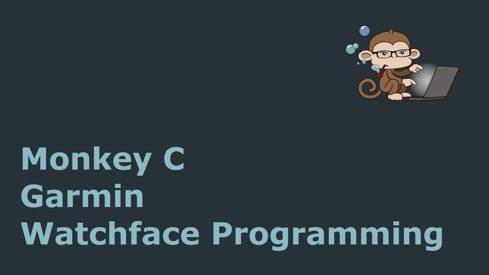

<p align="center">

</p>

# Custom Garmin Watchface - Monkey C Project

## Table of Contents
- [Overview](#overview)
- [Features](#features)
- [Usage](#usage)
- [Project Structure](#project-structure)
- [Contributing](#contributing)
- [Contact](#contact)
 

## Overview
This project is a custom Garmin watchface developed using Monkey C, showcasing time, date, and battery status, all with custom fonts and graphics. It is designed for a minimalist look with real-time updates every second, ensuring accurate information display.

## Features
- ***Real-time Time Display:*** Shows current time in an easy-to-read digital format.
- ***Custom Date Display:*** Displays the day of the week and full date.
- ***Battery Percentage Indicator:*** Displays the battery percentage on the top corner of the watch.
-  ***Custom Fonts and Graphics:*** Includes custom background images and fonts for a unique visual style.
-  ***Real-time Animation::*** Provides smooth refresh for accurate display updates.

## Installation

The app is published on the official store.<br>
[CIQ Store](https://apps.garmin.com/apps/31b7d2c1-23bd-4cc5-a423-8bd88753c221)

## Usage
Once installed, the watchface will display:
- Time: Large central time display.
- Date: Full date with day of the week.
- Battery: Current battery percentage in the top right corner.

## Project Structure
```
/source/
│   Watchface.mc      # Main source code file for watchface
│   Resources.xml     # Defines fonts and image resources
│
/resources/
│   fonts/            # Custom font files
│   images/           # Custom background and other images
│
manifest.xml          # Watchface version and permissions
```
  
## Contributing
Contributions are welcome! Feel free to fork this repository, make your changes, and submit a pull request.


## Contact
If you have any questions or suggestions, feel free to contact me at:  

**Vadym Kharchenko**  
Email: vadym.kharchenko@yahoo.com
  
